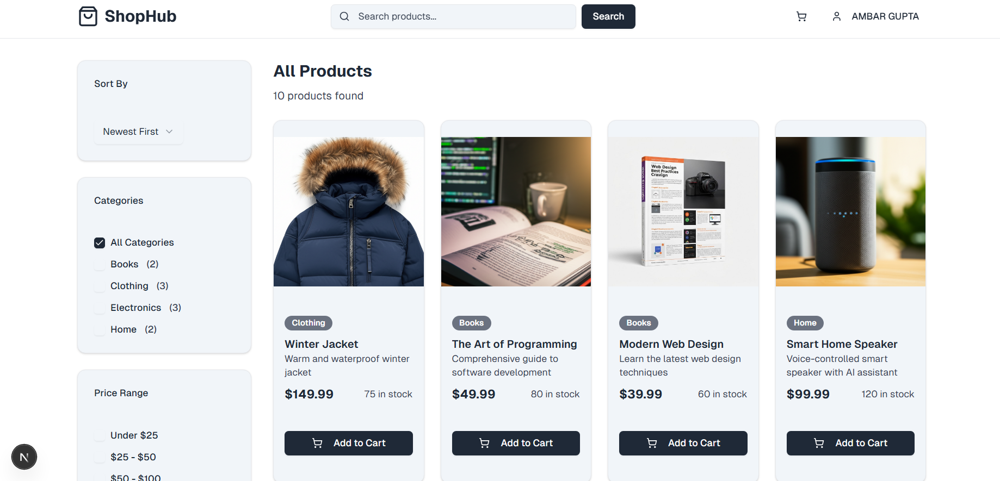
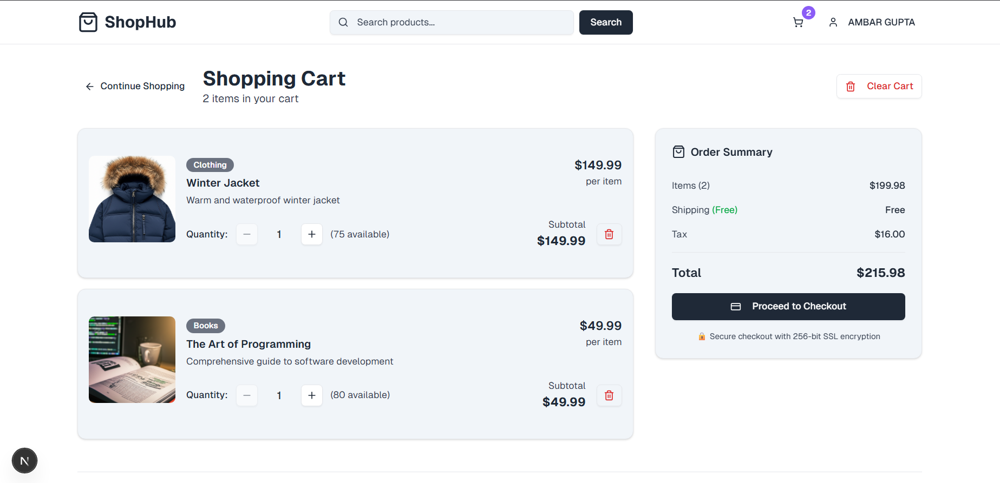
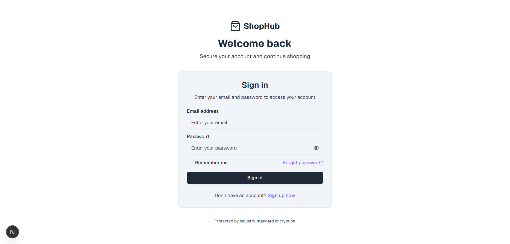

### Home/Product Listing Page




### Cart Page



### Login Page



# Ecom-Platform

A full-stack e-commerce web application built with Next.js, TypeScript, MongoDB, and Mongoose.

## Features

- User authentication (signup, login, JWT)
- Product listing with filters and search
- Shopping cart
- Responsive UI
- MongoDB Atlas integration

## Getting Started

### Prerequisites

- Node.js v18 or higher
- npm or pnpm
- MongoDB Atlas account (or local MongoDB)

### Installation

1. Clone the repository:
   ```bash
   git clone <your-repo-url>
   cd ecommerce-app
   ```
2. Install dependencies:
   ```bash
   npm install
   # or
   pnpm install
   ```
3. Set up environment variables:
   - Copy `.env.local.example` to `.env.local` and fill in your MongoDB URI and JWT secret.
   - Example:
     ```env
     MONGODB_URI=your_mongodb_connection_string
     JWT_SECRET=your_jwt_secret
     ```
4. Seed the database with sample products:
   ```bash
   npx ts-node --compiler-options '{"module":"commonjs"}' scripts/seed-database.ts
   ```

### Running the App

```bash
npm run dev
```

Visit [http://localhost:3000](http://localhost:3000) in your browser.

## Folder Structure

- `app/` - Next.js app routes and pages
- `components/` - UI and feature components
- `lib/` - Utility libraries (API client, MongoDB connection)
- `models/` - Mongoose models
- `scripts/` - Database seed scripts
- `public/` - Static assets (images, etc.)

## Screenshots

